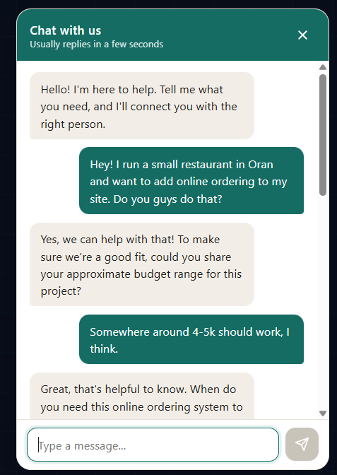
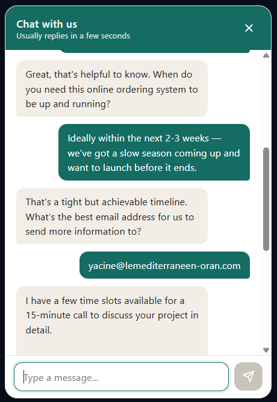
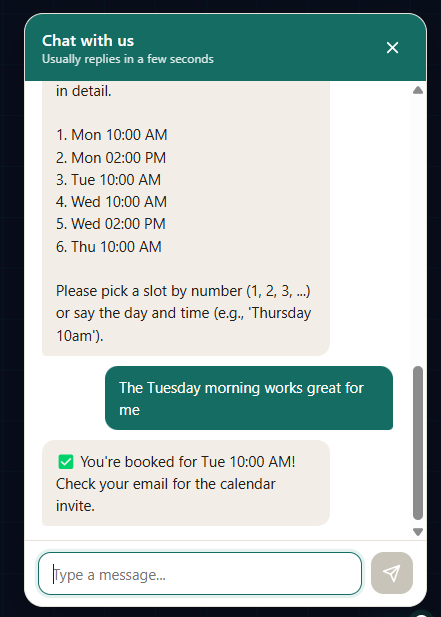
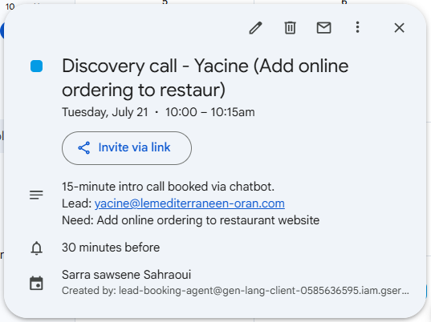
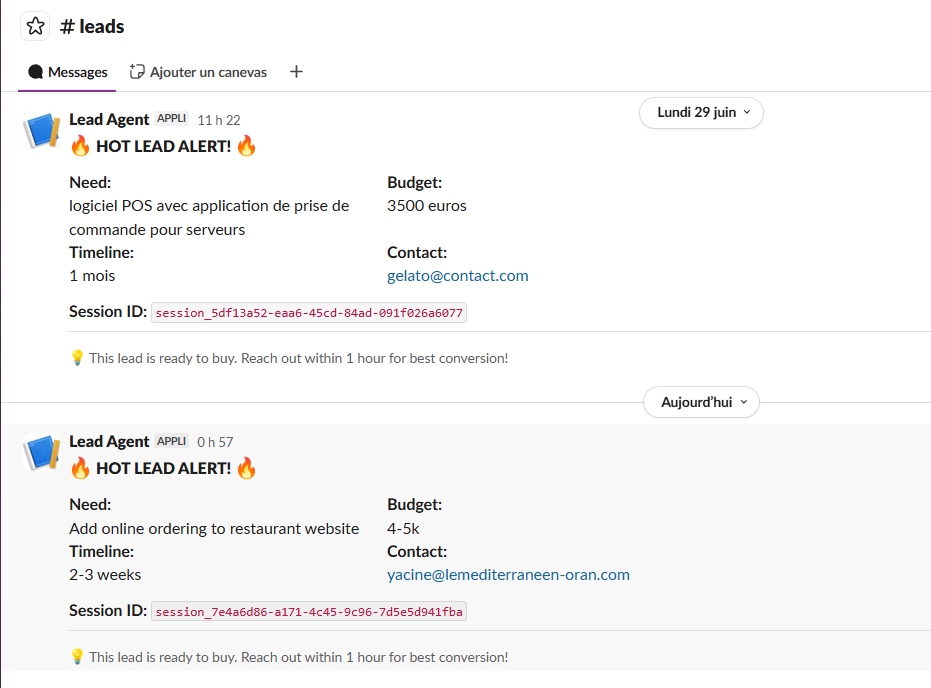
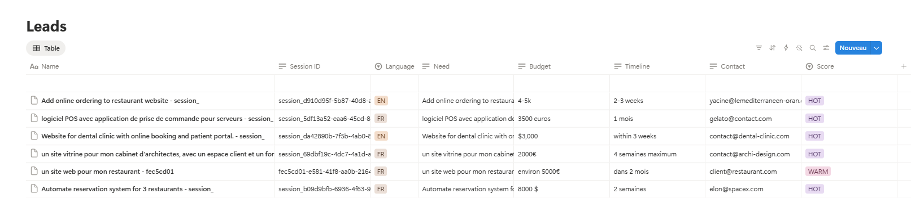

# Meetric


**Meetric is an AI chatbot that qualifies inbound sales leads in English, French, and Arabic, scores them hot/warm/cold, and books a discovery call directly into Google Calendar** — deployed as a chat widget that drops into any small-business website.

*The name says it all: turn every conversation into a metric, and the best ones into a meeting.*

Built with FastAPI + Google Gemini, backed by SQLite, with Google Calendar, Slack, and Notion integrations for the business owner.

<p align="center">
  <a href="https://meetric-61sn.onrender.com"><strong>→ Try the live demo</strong></a> ·
  <a href="https://meetric-61sn.onrender.com/docs"><strong>→ API docs</strong></a> ·
</p>

---

<a id="demo"></a>
## 🎥 Demo

<p align="center">
  
  <br>
  <em>Full loop: chat conversation → hot-lead scoring → Slack alert → Google Calendar booking, in under 30 seconds.</em>
</p>


### A real conversation, start to finish

> 🤖 **Meetric:** Hello! I'm here to help. Tell me what you need, and I'll connect you with the right person.
>
> 🧑 **Visitor:** Hey! I run a small restaurant in Oran and want to add online ordering to my site. Do you guys do that?
>
> 🤖 **Meetric:** Yes, we can help with that! To make sure we're a good fit, could you share your approximate budget range for this project?
>
> 🧑 **Visitor:** Somewhere around 4-5k should work, I think.
>
> 🤖 **Meetric:** Great, that's helpful to know. When do you need this online ordering system to be up and running?
>
> 🧑 **Visitor:** Ideally within the next 2-3 weeks — we've got a slow season coming up and want to launch before it ends.
>
> 🤖 **Meetric:** That's a tight but achievable timeline. What's the best email address for us to send more information to?
>
> 🧑 **Visitor:** yacine@lemediterraneen-oran.com
>
> 🤖 **Meetric:** I have a few time slots available for a 15-minute call to discuss your project in detail.
> 1. Mon 10:00 AM
> 2. Mon 02:00 PM
> 3. Tue 10:00 AM
> 4. Wed 10:00 AM
> 5. Wed 02:00 PM
> 6. Thu 10:00 AM
>
> Please pick a slot by number (1, 2, 3, ...) or say the day and time.
>
> 🧑 **Visitor:** The Tuesday morning works great for me
>
> 🤖 **Meetric:** ✅ You're booked for Tue 10:00 AM! Check your email for the calendar invite.

*Behind the scenes: this lead was scored 🔥 **HOT** (budget ≥ $1,000 and timeline ≤ 4 weeks), which fired an instant Slack alert to the business owner before the booking was even offered — no rigid form, no waiting. This exact conversation is captured in the screenshots below, start to finish.*

### Screenshots

<p align="center">



</p>
<p align="center"><em>The full conversation above, as it actually happened — greeting → need → budget → timeline → contact → slots offered → booked</em></p>

<table>
<tr>
<td width="50%">

<p align="center"><em>Event created in Google Calendar — right time, right lead, need included in the description</em></p>
</td>
<td width="50%">

<p align="center"><em>Instant Slack alert the moment a lead scores hot</em></p>
</td>
</tr>
</table>

<p align="center">

<br><em>Every lead — hot or warm, in English or French — logged to Notion as a permanent, filterable CRM record</em>
</p>

---

## Contents

- [The problem it solves](#the-problem-it-solves)
- [How it works](#how-it-works)
- [Architecture](#architecture)
- [Tech stack](#tech-stack)
- [Project structure](#project-structure)
- [Setup](#setup)
- [Testing](#testing)
- [API](#api)
- [Design decisions](#design-decisions)
- [Bugs fixed during development](#bugs-fixed-during-development)
- [Planned improvements](#planned-improvements)
- [Known limitations](#known-limitations)

---

## The problem it solves

Small businesses lose leads to slow follow-up. This bot sits on a website 24/7, has a structured conversation in whatever language the visitor writes in, extracts the four things a salesperson actually needs (need, budget, timeline, contact), scores the lead automatically, and — for the worthwhile ones — offers a real booking slot and creates the calendar event instantly, no human in the loop.

---

## How it works

The conversation is an explicit stage machine, not a freeform chat loop:

```
greeting → need → budget → timeline → contact → scoring → booking → closed
```

1. **Language detection** — first message determines en/fr/ar (Arabic via Unicode range, French via accent/keyword markers, English as default). The whole conversation stays in that language from there.

2. **Extraction** — every turn, a structured Gemini call reads the full conversation and extracts `need`, `budget`, `timeline`, `contact`, `name` — plus normalized numeric estimates (`budget_usd_estimate`, `timeline_weeks_estimate`) so "50 grand" / "نصف مليون" / "cinq cents euros" all become comparable numbers without regex gymnastics.

3. **Regex fallback** — if the Gemini extraction call fails (or just hasn't caught a field yet), a conservative regex extractor fills in what it safely can, so a single API hiccup never stalls the conversation. It's deliberately cautious — a missed field just means the bot asks again; a wrong guess would pollute scoring and the business owner's CRM.

4. **Stage advancement** — once a stage's field is filled, the bot moves to the next one. Each stage gets a tightly scoped system prompt with an explicit *forbidden actions* list, so the LLM doesn't invent discovery questions it shouldn't be asking.

5. **Scoring** — once all fields are present, `scorer.py` applies simple, readable thresholds:
   - **Hot** — budget ≥ $1,000 **and** timeline ≤ 4 weeks
   - **Warm** — some budget or some urgency
   - **Cold** — neither

6. **Routing on score:**
   - Hot → instant Slack alert + calendar booking offered immediately
   - Warm → logged to Notion + calendar booking offered, softer framing
   - Cold → polite close, no booking

7. **Booking** — queries the Google Calendar freebusy API in real time to find the next available weekday slots (10am/2pm). When the lead picks one, `calendar_utils.py` creates a 15-minute event with reminders directly in Google Calendar. The lead receives a confirmation message in the chat with the event details (email invites are omitted because service accounts can't add attendees without domain-wide delegation — a trade-off that keeps the bot fully autonomous and zero-config for Gmail users), and the confirmation is saved to SQLite as a local audit log. Double-booking is prevented both at the DB layer (`UNIQUE` constraint on `slot_time`, claimed before the calendar API call) and by re-checking freebusy right before creation — verified directly with two simultaneous customers racing for the same slot: exactly one wins, exactly one calendar event is created.

8. **Every lead** (hot, warm, or cold) is logged to Notion as a permanent CRM record.

---

## Architecture

```
widget (/widget — auto-opens on load)
    │  POST /chat { session_id, message }
    ▼
main.py (FastAPI + rate limiting)
    │
    ▼
agent.py  ──────────────────► generator.py ──► Gemini API
(stage machine,                                  conversation reply +
 scoring trigger,                                structured extraction
 booking trigger)
    │
    ├──► db.py (SQLite)
    │    sessions / leads / bookings (race guard + audit log)
    │
    ├──► scorer.py
    │
    ├──► booking.py ──► calendar_utils.py ──► Google Calendar API
    │                   (freebusy check +        (real event creation)
    │                    slot generation)
    │
    └──► notifier.py ──► Slack webhook (background task)
                     └──► Notion API   (background task)
```

---

## Tech stack

| Layer | Choice | Why |
|---|---|---|
| API | FastAPI + Uvicorn | Async, fast, great DX for a portfolio piece |
| LLM | Gemini 2.5 Flash-Lite | Best-in-class at instruction following + multilingual, at a fraction of Flash's cost |
| Validation | Pydantic v2 | Two schemas: strict business rules vs permissive extraction |
| Storage | SQLite + WAL mode | Single-file, zero-setup; WAL handles concurrent sessions |
| Calendar | Google Calendar API + Service Account | Real-time availability, real events, no OAuth flow needed |
| Notifications | Slack Webhooks + Notion API | What a real SMB owner would actually check; fire-and-forget so a slow third-party API never delays a lead's reply |
| Rate limiting | slowapi | Per-IP limit on `/chat` to prevent Gemini cost abuse |
| Deployment | Docker + Render | One `docker build` and it's live |

---

## Project structure

```
.
├── main.py               # FastAPI app, routes, rate limiting, CSV export
├── agent.py              # Stage machine, prompt construction, orchestration
├── generator.py          # Gemini client: replies + structured extraction
├── model.py              # Pydantic schemas (LeadProfile, ExtractedLeadFields)
├── scorer.py             # Hot/warm/cold logic
├── booking.py            # Slot confirmation, availability check, audit log
├── calendar_utils.py     # Google Calendar: freebusy query + event creation
├── notifier.py           # Slack + Notion integrations
├── db.py                 # SQLite layer (sessions, leads, bookings)
├── config.py             # Env vars, thresholds, stage list, temperatures
├── static/
│   ├── widget.html       # Chat widget UI (/widget) — opens automatically
│   └── landing.html      # Portfolio landing page (/)
├── demo/                 # Screenshots + demo video/GIF used in this README
├── tests/
│   ├── conftest.py           # Isolated temp DB per test
│   ├── test_scorer.py        # 7 tests — hot/warm/cold thresholds
│   ├── test_agent_stages.py  # 9 tests — stage machine, field-skip logic
│   └── test_booking.py       # 13 tests — slot parsing, race condition guard
├── .env.example
├── Dockerfile
└── requirements.txt
```

---

## Setup

### Prerequisites
- Python 3.12+
- A Gemini API key (free tier works): [aistudio.google.com/apikey](https://aistudio.google.com/apikey)
- A Google Cloud project with the **Calendar API enabled** and a **Service Account** JSON key
- Optional: Slack webhook URL, Notion integration token + database ID

### Google Calendar setup

1. Go to [console.cloud.google.com](https://console.cloud.google.com) → create a project
2. Enable the **Google Calendar API** (APIs & Services → Library)
3. Create a **Service Account** (APIs & Services → Credentials → Service Account), then generate a **JSON key** and download it
4. In Google Calendar → Settings → your calendar → **Share with specific people**, add the service account email with *"Make changes to events"* permission
5. Copy the calendar's ID from its settings page (looks like `abc123@group.calendar.google.com`)

### Run locally

```bash
git clone https://github.com/YOUR_USERNAME/meetric
cd meetric

python -m venv venv
source venv/bin/activate   # Windows: venv\Scripts\activate
pip install -r requirements.txt
```

Copy `.env.example` to `.env` and fill in your keys:

```bash
cp .env.example .env
```

```env
# ─── Required ────────────────────────────────────────────────────
GEMINI_API_KEY=your_gemini_key_here
EXPORT_TOKEN=some-long-random-string      # for /leads/export

# ─── Google Calendar ─────────────────────────────────────────────
GOOGLE_CALENDAR_ID=your_calendar_id@group.calendar.google.com
GOOGLE_CREDENTIALS_JSON={"type":"service_account","project_id":...}
BUSINESS_TIMEZONE=Africa/Algiers          # any IANA timezone name

# ─── Optional ────────────────────────────────────────────────────
SLACK_WEBHOOK_URL=
NOTION_API_KEY=
NOTION_DATABASE_ID=
ALLOWED_ORIGINS=*                          # comma-separated to restrict CORS
```

> **Tip for `GOOGLE_CREDENTIALS_JSON`:** paste the entire content of your downloaded service account JSON key as a single-line string, or use `$(cat credentials.json | tr -d '\n')` to flatten it.

```bash
uvicorn main:app --reload
```

| URL | What you get |
|---|---|
| `http://localhost:8000/widget` | Chat demo — opens automatically |
| `http://localhost:8000/` | Landing page |
| `http://localhost:8000/docs` | Swagger UI |
| `http://localhost:8000/health` | JSON health check |

### Docker

```bash
docker build -t meetric .
docker run -p 8000:8000 --env-file .env meetric
```

---

## Testing

29 tests across the three areas most likely to hide a subtle bug: `score_lead` (hot/warm/cold thresholds, including Gemini-estimate vs regex-fallback paths), `_get_next_stage`/`_is_complete` (the stage machine), and `parse_booking_choice`/`confirm_booking` (free-text slot parsing, calendar failure rollback, and the race-condition guard). Writing these — and later, deliberately trying to break the running app with concurrent requests, malformed input, and adversarial data — surfaced real bugs that code review alone hadn't caught, documented in full below.

```bash
pytest tests/ -v
```

Each test runs against a throwaway SQLite file (`conftest.py` patches `db.DB_FILENAME` to a `tmp_path`), so the suite never touches your real `leads.db`. Google Calendar and Slack/Notion calls are mocked, so no live credentials are needed to run the suite.

---

## API

| Endpoint | Method | Auth | Purpose |
|---|---|---|---|
| `/` | GET | — | Landing page |
| `/health` | GET | — | JSON health check (runs a real `SELECT 1`) |
| `/chat` | POST | — | Send a message, get the bot's reply |
| `/widget` | GET | — | Chat widget demo (auto-opens on load) |
| `/leads/export` | GET | `X-Export-Token` header | Download all leads as CSV |
| `/docs` | GET | — | Auto-generated Swagger UI |

**`/chat` request body:**
```json
{ "session_id": "abc123", "message": "Hi, I need a website" }
```

**Rate limits:** `/chat` is capped at 20 req/min per IP; `/leads/export` at 10 req/min.

---

## Design decisions

**Stage-scoped prompts over one mega-prompt.** Each stage gets an explicit task and an explicit *forbidden actions* list. Without the latter, the LLM reliably "helps" by asking extra discovery questions a lean qualifier shouldn't be asking — asking about business risks during the budget stage, for example.

**Two separate Pydantic schemas.** `LeadProfile` enforces business rules (valid stage, valid language); `ExtractedLeadFields` is deliberately permissive. Mid-conversation, most fields are legitimately still blank, and returning `None` on extraction failure (rather than empty values) means a failed API call never silently overwrites previously known answers.

**LLM-based numeric normalization over regex.** Budget/timeline parsing used to be pure regex, which is an unbounded pattern-matching problem across three languages. Gemini is asked directly for a normalized USD/weeks estimate; regex is kept only as a cautious fallback that stays silent rather than guess wrong.

**Service Account over OAuth2 for Google Calendar.** The bot acts autonomously — there's no user present to complete a browser login flow. A service account with calendar delegation is the right fit: one JSON key in the environment, no token refresh logic needed.

**DB claim before calendar API call.** `db.save_booking()` runs before `create_calendar_event()`. This means the UNIQUE constraint on `bookings.slot_time` is the actual atomic race guard — not a check that can be raced between two concurrent requests. If the calendar call fails after the DB claim, the record is rolled back so the slot stays retryable.

**`INSERT OR IGNORE` + try/except double-guard on lead saves.** A retried request must never crash the conversation or create duplicate leads — guarded at both the application layer and the DB layer.

**`/` serves HTML, `/health` serves JSON.** The root URL is what a potential client sees first. Infrastructure health checks get their own dedicated endpoint.

**`hmac.compare_digest` for export token.** Constant-time comparison on the `X-Export-Token` header prevents timing-based token enumeration — an attacker can't infer how many characters of their guess are correct by measuring response latency.

**Notifications are fire-and-forget.** Slack alerts and Notion logging are pure side effects for the business owner's benefit — they have nothing to do with answering the lead, so they run as background tasks instead of blocking the chat reply. Measured directly: awaiting both sequentially added 4 seconds to a hot lead's reply when the third-party APIs were slow; backgrounding them brought that to under 100ms.

---

## Bugs fixed during development

Writing tests first, then deliberately trying to break the running app — concurrent requests, adversarial input, simulated third-party failures, and eventually a real end-to-end conversation run against live Slack/Notion/Calendar — surfaced real bugs that mocked tests alone hadn't caught. A few of the ones that mattered most:

- **Booking times were off by 48 minutes, silently.** A real conversation booked a "2:00 PM" slot that showed up in Google Calendar at 2:48 PM. Root cause: `datetime(..., tzinfo=BUSINESS_TZ)` — passing a `pytz` timezone directly to the `datetime()` constructor is a well-known trap; pytz can only compute the correct UTC offset via `.localize()`. Direct construction silently used the timezone's raw historical offset instead. Every test up to this point mocked `calendar_utils` entirely, so this never had a chance to surface — found only once a real conversation ran against the real Google Calendar API.
- **A day name + time together could book the wrong slot.** Saying "friday 02:00pm" booked *Thursday* 2:00 PM instead. Root cause: the time-parsing regex grabbed the minutes ("00") instead of the hour ("02") from an `HH:MMam/pm` input, and — once that silently failed to match anything — a separate fallback then misread the "02" from inside "02:00pm" as "pick slot #2." Fixed by parsing day and time together as the most specific signal, and by no longer letting the numeric-index fallback fire when a day name is present in the message.
- **Booking could silently confirm the wrong slot** if calendar availability shifted between being offered and confirmed. Fixed by resolving against the exact list the user was shown, never a fresh re-fetch.
- **A double-booking race between two different customers**, verified directly: two customers confirming the same last slot simultaneously — exactly one wins, exactly one calendar event is created.
- **CSV export was vulnerable to formula injection** — a lead's free-text fields could contain a payload like `=HYPERLINK(...)` that executes when opened in Excel. Every exported cell is now sanitized.
- **A hot lead's chat reply was blocked on Slack + Notion**, sequentially — measured a 4-second delay from two notification calls that have nothing to do with answering the lead. Now fire-and-forget.
- **Concurrent messages to the same session could silently drop data** — two messages arriving at once for one conversation could overwrite each other with no error. Fixed with a per-session lock.

<details>
<summary><strong>Show the full list — 25 fixes, in the order they were found →</strong></summary>

- **`/chat` and `/leads/export` rate-limited** (20/min and 10/min per IP) — without this, a single client could run up the Gemini bill.
- **`create_session` race condition** — two near-simultaneous first messages with the same `session_id` crashed one with an uncaught `IntegrityError`. Now uses `INSERT OR IGNORE`.
- **Booking double-booking race** — `bookings.slot_time` is now `UNIQUE` at the DB layer; the DB claim now happens *before* the Google Calendar API call so two concurrent confirmations can't both succeed.
- **Calendar failure didn't release the DB slot** — if `create_calendar_event` threw after `db.save_booking()` succeeded, the slot was permanently claimed with no event on calendar. The DB record is now deleted on calendar failure so the slot stays retryable.
- **`test_booking.py` excluded from CI** — `create_calendar_event` and `_get_busy_times` were never mocked, so every test made real API calls with fake credentials and failed. All three external dependencies are now properly patched; `test_booking.py` is back in `ci.yml`.
- **Unbounded conversation history** — capped to 16 turns (`MAX_HISTORY_TURNS`) before every Gemini call. Verified a 60-turn conversation stays fast and small (~8KB), and that information given at turn 1 is still remembered at turn 40, since accumulated `profile_fields` persist independently of the capped context window.
- **SQLite concurrency** — `get_db()` sets `PRAGMA journal_mode=WAL`, so reads and writes from concurrent sessions don't serialize on a single lock.
- **Logging** — `main.py` calls `logging.basicConfig()` explicitly; `/chat` error handler uses `exc_info=True` so tracebacks actually reach the logs.
- **`/health` runs a real `SELECT 1`** instead of always claiming `"online"`.
- **Two bugs in `parse_booking_choice`** surfaced by the test suite: "2pm" wasn't parsed (the am/pm regex was defined but never called), and "wednesday" didn't match (only 3-letter abbreviations were checked).
- **Stage variable stale-read** in the booking flow caused the bot to loop on "I have everything I need" instead of offering slots.
- **Widget demo page was blank** — `/widget` now shows a branded dark backdrop and the chat opens automatically on load.
- **`STAGE_TEMPERATURE` was a local dict in `agent.py`** — moved to `config.py` alongside the other stage configuration so all stage-related constants live in one place.
- **Booking could silently confirm the wrong slot.** `confirm_booking()` re-fetched a fresh slot list from Google Calendar and looked up the user's chosen index in *that* list — which can differ from the list the user was actually shown if availability shifted in between (another lead booking a slot, a day boundary passing). Reproduced directly: a user picking "Tue 2:00 PM" was silently booked into "Thu 2:00 PM," no error shown. Fixed by threading the exact list the user saw (`known_slots`) through to the lookup, so the index always resolves against what was actually displayed.
- **Google Calendar calls were blocking the event loop.** `generate_available_slots()` and `confirm_booking()` make live, synchronous network calls to Google Calendar but were called directly inside `async def process_message` — unlike every Gemini call, which is correctly wrapped in `asyncio.to_thread`. During a slow calendar round-trip, this stalled every other visitor's conversation, not just the one booking. Now wrapped consistently with the Gemini calls.
- **Calendar credentials/service rebuilt on every call.** A single booking confirmation could trigger the Calendar API client being rebuilt from scratch (JSON parse, RSA signer, API discovery) up to 3 times. Now cached as a module-level singleton in `calendar_utils.py`.
- **`bookings.db` was missing from `.gitignore`/`.dockerignore`.** Unlike `leads.db`, the booking audit database (which holds the same PII — name, email, need — for every confirmed booking) wasn't excluded from either file. Added.
- **CORS was hardcoded to `allow_origins=["*"]`.** Fine as a default for an embeddable widget with an unknown deploy domain, but not configurable without a code change. Now reads an optional `ALLOWED_ORIGINS` env var (comma-separated), defaulting to `*`.
- **Concurrent requests to the SAME session could silently drop data.** `get_session()` → mutate in memory → `update_session()` is a read-modify-write with no locking. Two messages arriving for the same `session_id` at nearly the same instant (a double-tap send, a client-side network retry) could each read the same starting state and whichever wrote last would silently overwrite the other's changes — reproduced directly: racing "I need a website" against "my budget is $4000" for one session lost the "need" field entirely, no error. `widget.html`'s own `isProcessing` flag prevents this in normal use, but it wasn't enforced server-side. Fixed with a per-session `asyncio.Lock` (reference-counted so it doesn't grow unbounded) that serializes messages within one session while leaving every other session fully concurrent.
- **The lead's name was never captured, anywhere.** `agent.py` read `profile_fields.get("name", "Lead")` for the calendar event, but nothing in the codebase ever wrote a `name` key — not Gemini's extraction schema, not the regex fallback, not the DB defaults. Every booking, regardless of what the lead said, showed up as "Discovery call - Lead." Added `name` to `ExtractedLeadFields` and the extraction prompt (`generator.py`), plus a conservative English/French regex fallback (`"my name is X"`, `"I'm X"`, `"je m'appelle X"`) for when the Gemini call fails.
- **The regex fallback could invent a budget from unrelated digits.** This fallback runs on every turn (not just when Gemini fails), and its last-resort pattern was a bare `(\d+)` with no context requirement — a lead who only ever gave a phone number, with no budget stated, ended up with a phantom `budget_usd_estimate` that flipped their score from "cold" to "warm." Rewrote the budget parser to require an actual currency signal (a `$` sign before *or* after the number, a `k`/`thousand`/`grand` multiplier, a written currency name, or an explicit "budget"/"cost"/"price" word within 15 characters of the digits) before ever guessing a number — a missed budget just means the bot asks again; a wrong one shouldn't reach the business owner's CRM. Also fixed the original trailing-currency-symbol bug (`"12,500$"` was parsing as `"$12"`) as part of the same rewrite.
- **Business timezone was hardcoded to `Africa/Algiers`.** Now reads an optional `BUSINESS_TIMEZONE` env var (any IANA name), validated at import time so a typo fails fast instead of silently breaking bookings later. Also fixed the actual Google Calendar event payload, which still had `"Africa/Algiers"` hardcoded even though slot generation used the timezone object — a deployment with a custom timezone would have generated correctly-timed slots but booked the calendar event in the wrong zone.
- **A hot lead's chat reply was blocked on Slack + Notion, sequentially.** Measured directly: simulating both taking 2 seconds (a normal "third-party API having a slow moment," not even a failure) added 4 seconds to a hot lead's reply time, purely waiting on internal notifications that have nothing to do with answering them. Both now fire as background tasks (`asyncio.create_task`, reference-counted to avoid premature garbage collection, wrapped so any unexpected exception is logged with context instead of surfacing as a raw, unhandled asyncio warning) — the lead gets their reply immediately, and the notifications land moments later.
- **Verified real double-booking protection between two different customers, under real concurrency.** Simulated two different customer sessions both confirming the same single remaining slot at the same instant: exactly one succeeds, exactly one Google Calendar event is created, and the other receives a clean "this slot was just taken" message — the DB-claim-before-calendar-call design holds under actual concurrent load, not just in theory.
- **Booking times were off by 48 minutes — the classic pytz "direct tzinfo construction" trap.** `generate_available_slots()` built each slot with `datetime(year, month, day, hour, 0, tzinfo=BUSINESS_TZ)`. Passing a pytz timezone object directly as `tzinfo=` bypasses pytz's offset resolution entirely and silently uses the zone's raw/historical offset instead of its real modern one — for Africa/Algiers, a 48-minute error. A slot generated and displayed as "2:00 PM" was actually sent to Google Calendar as 2:48–3:03 PM. Every prior test mocked `calendar_utils` completely, so this had no chance to surface until a real conversation ran against the real Calendar API. Fixed by using `BUSINESS_TZ.localize(...)` instead, which is pytz's only correct way to attach a timezone to a naive datetime.
- **A day name + time together in the same message could book the wrong slot.** "friday 02:00pm" booked *Thursday* 2:00 PM instead of Friday. Two compounding bugs: (1) the time-parsing regex `(\d{1,2})\s*(am|pm|h)` matched the MINUTES ("00" in "02:00pm") rather than the hour, because it had no way to skip over a `:MM` — that silently resolved to hour 12, matched no offered slot, and fell through; (2) the fallback slot-index regex then matched the bare "02" from inside "02:00pm" and returned "slot number 2" — coincidentally also a 2 PM slot, just the wrong day, which made the failure easy to miss at a glance. Fixed by parsing an optional `:MM` in the hour regex, checking a day+hour combination as the most specific match before any fallback, and refusing to let the numeric-index fallback fire at all when a day name is present in the message (also fixed the day-name matching itself to use word boundaries, so "money" no longer false-matches "mon" as Monday).

</details>

---

## Planned improvements

These are known gaps that aren't blockers for the current deployment but are next on the list.

**Slot display localization.** Day names in the booking stage always render in English ("Tue 10:00 AM", "Wed 02:00 PM") regardless of the conversation language, because `strftime("%a %I:%M %p")` is locale-unaware. In a French or Arabic conversation this is jarring. The fix is straightforward: build the display string manually per language in `generate_available_slots`, or pass the detected language through to `calendar_utils.py` and format accordingly.

**Automated email confirmation to the lead.** After a booking is confirmed, the lead currently only receives a chat message — nothing in their inbox. For a real deployment, sending a proper confirmation email with the date, time, and a calendar `.ics` attachment is the feature that makes the experience feel production-grade. Plan: use [Resend](https://resend.com) (generous free tier, single API call, works without an SMTP server) and trigger it from `confirm_booking()` right after the calendar event is created.

**"Checking availability" typing indicator.** The freebusy query to Google Calendar can take 1–2 seconds. During this time the widget is silent. A short "Checking available slots…" message before the list appears would make the wait feel intentional rather than broken.

**Cross-language day-name resolution in slot parsing.** When a lead says "vendredi à 10h" (French for "Friday at 10") and a slot for Friday exists in the list, the parser should consistently return it. Edge cases around mixed-language input (French day + English time format, Arabic numerals mixed with Latin) need coverage in the test suite before this can be called reliable.

**Durable retry for Slack/Notion notifications.** They're fire-and-forget background tasks now — fast, and never block a lead's reply — but a failure is currently only logged, not retried. Fine at current scale; a small retry-with-backoff (or a durable queue) would be the next step if every hot-lead alert landing becomes business-critical.

---

## Known limitations

- **SQLite is synchronous.** WAL mode reduces lock contention, but the calls still block the event loop. `aiosqlite` or Postgres is the right fix at real scale (see commented-out line in `requirements.txt`).
- **Widget embeds via `window.location.origin`.** To embed on a client's own domain, the `API_BASE` in `widget.html` needs to point to the deployed API URL explicitly (set via the `API_BASE_URL` environment variable).
- **Existing `leads.db` files won't pick up the `UNIQUE` constraint** on `bookings.slot_time` automatically — `CREATE TABLE IF NOT EXISTS` only applies to new databases. A live upgrade needs a one-time migration.
- **No structured error tracking.** Logs go to stdout only, which is fine for Render's log viewer, not great for being paged at 2am.
- **No email confirmation to the lead after booking.** The chat confirms the slot but no email is sent. This is the most visible gap for a real-world deployment and is the first item in Planned improvements above.
- **Render free tier cold starts.** The service spins down after 15 minutes of inactivity and takes ~30 seconds to wake. Acceptable for a portfolio demo; upgrade to the $7/month plan for client-facing use.
